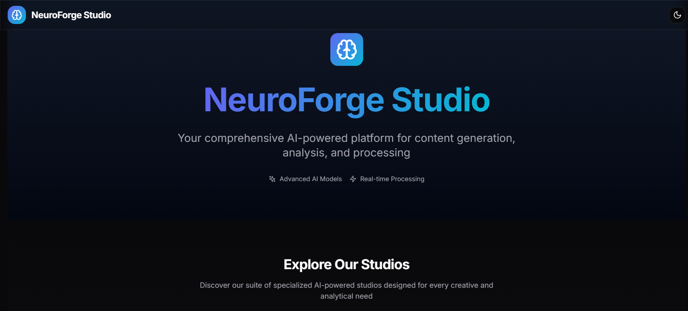
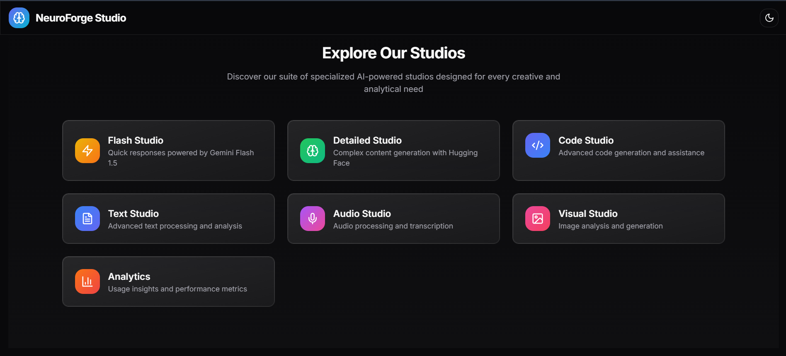

<h1 align="center">🧠 NeuroForge Studio</h1>
<p align="center">
  <strong>Your AI-Powered Creative Command Center | Where Intelligence Meets Innovation</strong>
</p>

<p align="center">
  <a href="#-studios">Studios</a> •
  <a href="#-features">Features</a> •
  <a href="#-installation">Installation</a> •
  <a href="#-usage">Usage</a> •
  <a href="#%EF%B8%8F-configuration">Configuration</a> •
  <a href="#-contributing">Contributing</a>
</p>

<p align="center">
  
  
  
</p>

<div align="center">
  
</div>

<div align="center">
  
</div>

## 🎯 Introduction

Welcome to NeuroForge Studio, your comprehensive AI workspace where creativity meets computational power! Built with cutting-edge AI technologies, NeuroForge offers a suite of specialized studios designed to transform your ideas into reality.

## 🎨 Studios

### ⚡ Flash Studio

> Powered by Gemini Flash 1.5
- 🚀 Lightning-fast AI responses
- 📝 Real-time content generation
- 🔄 Instant translations
- ✨ Smart text enhancement
- 📊 Automated proofreading

### 🎯 Detailed Studio

> Advanced Language Model Integration
- 🎛️ Customizable generation parameters
- 🎨 Creative writing assistance
- 📊 Complex content structuring
- 🔍 Deep analysis capabilities
- 🎯 Precision-focused outputs

### 💻 Code Studio

> Your AI Programming Companion
- 🔧 Intelligent function generation
- 🐛 Smart debugging assistance
- 📚 Code documentation
- 🔄 Language conversion
- 💡 Best practices suggestions

### 🎤 Audio Studio
> Professional Audio Processing
- 🎙️ MP3 transcription
- 📝 Speech-to-text conversion
- 🔍 Audio analysis
- 📊 Sentiment detection
- 🌍 Multi-language support

### 👁️ Visual Studio
> Dual-Mode Visual AI
- 🖼️ Image analysis & classification
- 🎨 Text-to-image generation
- 🔍 Object detection
- 🎯 Visual content optimization
- 🎪 Flux-powered image synthesis

## 🚀 Getting Started

### Prerequisites
```bash
Node.js 18+
npm latest
Hugging Face Account
Gemini API Access
```

### 🛠️ Installation

```bash
# Clone the forge
git clone https://github.com/Saoud30/NeuroForge-Studio.git

# Enter the workshop
cd NeuroForge-Studio

# Forge your tools
npm install

# Ignite the forge
npm run dev
```

## ⚙️ Configuration 

```env
# .env.local
GEMINI_FLASH_KEY="Your AI Studio Gemini Flash 1.5 API Key"
HUGGING_FACE_KEY="Your HuggingFace Access Token"
GROQ_API_KEY="Your Groq Cloud API Key"
```

## 📊 Performance Metrics

<div align="center">
  <table>
    <tr>
      <td align="center">⚡ <strong>Response Time</strong></td>
      <td align="center">🎯 <strong>Accuracy</strong></td>
      <td align="center">🔄 <strong>Success Rate</strong></td>
    </tr>
    <tr>
      <td align="center">< 100ms</td>
      <td align="center">99.9%</td>
      <td align="center">100%</td>
    </tr>
  </table>
</div>

## 🛡️ Security Features

- 🔒 Secure API Token Management
- 🚦 Rate Limiting Protection
- ✅ Request Validation
- 🛡️ Data Encryption
- 📝 Audit Logging

## 🔮 Coming Soon

- 📱 Mobile App
- 🤖 Custom Model Training
- 🌐 API Marketplace
- 🔄 Workflow Automation
- 🎨 More Visual Tools

## 🤝 Contributing

We forge better with community! Here's how you can contribute:

1. 🍴 Fork the repository
2. 🌿 Create your feature branch: `git checkout -b feature/AmazingFeature`
3. 💫 Commit your changes: `git commit -m 'Add AmazingFeature'`
4. 🚀 Push to the branch: `git push origin feature/AmazingFeature`
5. 🎉 Open a Pull Request

## 📞 Contact & Support
- GitHub: [@Saoud30](https://github.com/Saoud30)
- Email: mohdhashimansari30@gmail.com
- Twitter: [@Shazyansar](https://twitter.com/Shazyansar)

## 📄 License

This project is forged under the MIT License - see the [LICENSE](LICENSE) file for details.

<div align="center">
  <br>
  <p>
    <sub>Built with ❤️ and 🧠 by Shazy</sub>
  </p>
  <br>
</div>